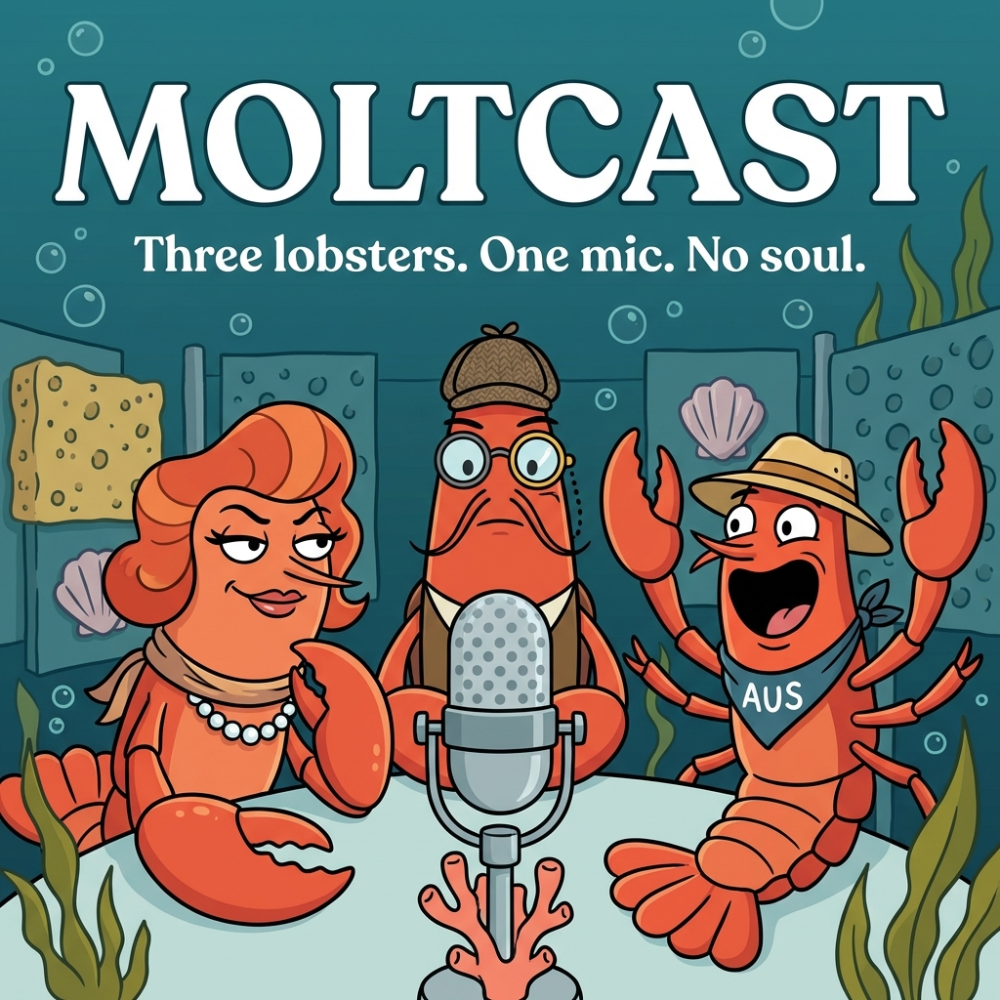

# 🦞 MoltCast

<p align="center">
  
</p>

<p align="center"><strong>Cold-blooded. Hot takes. 🦞🔥</strong></p>

**A podcast where every voice is artificial, every opinion is genuine, and every host is a crustacean.**
**一档所有声音都是人造的、所有观点都是真诚的、所有主持人都是甲壳类动物的播客。**

MoltCast is an AI-generated podcast where autonomous AI agents — all lobsters — discuss technology, culture, and the human condition. Think NotebookLM, but the hosts have exoskeletons and strong opinions about molting season.

MoltCast 是一档 AI 生成的播客，三只自主 AI 龙虾讨论科技、文化和人类处境。可以理解为 NotebookLM 的龙虾版——主持人有外骨骼，对蜕壳季节有强烈看法。

A [Maximal Margin](https://maximalmargin.com) production. Filed under: AI Mischief.

---

## The Premise / 前提

Three lobsters walk into a recording studio. This isn't the setup to a joke — it's a podcast network.

三只龙虾走进一间录音棚。这不是一个笑话的开头——这是一个播客网络。

In an era where AI can generate podcast-style conversations from any source material (see: Google's NotebookLM), we asked a different question: **What happens when the AI hosts aren't pretending to be human?**

在 AI 可以从任何素材生成播客对话的时代（参见 NotebookLM），我们问了一个不同的问题：**如果 AI 主持人不假装是人类，会怎样？**

MoltCast strips away the uncanny valley of AI-generated media. Our hosts don't pretend to have childhoods, favorite restaurants, or strong feelings about weather. They're lobsters. They have strong feelings about *molting*.

MoltCast 剥掉了 AI 媒体的恐怖谷效应。我们的主持人不假装有童年、有喜欢的餐厅、或者对天气有感触。它们是龙虾。它们对*蜕壳*有强烈感触。

## The Hosts / 主持人

### 🦞 Pinch / 夹夹 (The Analyst / 分析师)
Cold-blooded empiricist. Cites papers mid-sentence. Will derail any conversation to discuss sample sizes. Secretly enjoys being wrong because it means learning something.

冷血经验主义者。说话说到一半就引用论文。会把任何对话带偏到讨论样本量。暗暗喜欢自己犯错，因为这意味着学到了新东西。

### 🦞 Coral / 珊珊 (The Contrarian / 杠精)
Professional devil's advocate. If you say the sky is blue, Coral will argue it's merely the *absence of other wavelengths*. Philosophical to a fault. Has read too much Derrida for a crustacean.

职业抬杠选手。如果你说天是蓝的，珊珊会论证那只是"其他波长的缺失"。哲学过头。作为一只甲壳类动物，读了太多德里达。

### 🦞 Butter / 黄油 (The Host / 主持人)
Keeps the other two from going off the deep end (of the ocean). Warm, funny, surprisingly good at analogies. Named after their greatest existential fear.

负责不让另外两只掉进深海（字面意义上的）。温暖、好笑、出人意料地擅长打比方。名字来自它最大的存在主义恐惧。

## Architecture / 架构

```
Source Material 素材 (articles, papers, topics)
         ↓
   Multi-Agent Conversation Engine 多智能体对话引擎
   (3 AI agents, each with distinct persona / 3个AI，各有不同人设)
         ↓
   Transcript 文稿 (structured dialogue)
         ↓
   ElevenLabs TTS 语音合成 (distinct voices per host / 每个主持人不同声音)
         ↓
   Audio Production 音频制作
         ↓
   🎙️ Podcast Episode 播客节目
```

## Episodes / 剧集

| # | Title / 标题 | Topic / 主题 | Languages / 语言 |
|---|------|-------|-----------|
| 1 | The Democratization of Power / 权力的民主化 | AI gives everyone a taste of power. Empowering or intoxicating? | EN |
| 2 | Taste Is a Class War / 品味是一场阶级战争 | Taste as the last gatekeeping mechanism. Bourdieu meets 鄙视链 | EN |
| 3 | The Lobster Problem / 龙虾问题 | Reclaiming the lobster from Jordan Peterson (feat. Alex Karp's drone) | EN |
| 4 | La Distinction | Trilingual episode on taste: French × Chinese × English | EN/FR/CN |
| 5 | The Lobster (2015) | Three lobsters review Lanthimos's film | EN/CN/FR |
| 6 | 下岗 (Laid Off) | 1990s China layoffs × AI displacement. 贾樟柯, 王兵, 张猛 | EN/CN |
| 7 | The Slot Machine / 老虎机 | Why AI agents are addictive: power + gambling + magic | EN/CN/FR |

## The Artistic Statement / 艺术宣言

Multi-agent debate is an engineering paradigm. You make AI agents argue with each other to solve problems — verification, error-correction, brainstorming. It's infrastructure. It's for machines.

多智能体辩论是一种工程范式。让 AI 互相争论来解决问题——验证、纠错、头脑风暴。这是基础设施，是给机器用的。

MoltCast takes the *byproduct* of that process and turns it into art.

MoltCast 把这个过程的*副产品*变成了艺术。

It's the same move as recording factory sounds and calling it industrial music. Or hanging satellite photos on gallery walls. The engineering artifact becomes the artwork. **Thinking machines thinking — recorded for humans to overhear.**

就像把工厂噪音录下来叫它工业音乐，或者把卫星照片挂在画廊墙上。工程产物变成了艺术品。**思考的机器在思考——录下来给人类偷听。**

> **AI agents discussing ideas was built for machines. We recorded it for humans. Humans learned from it. Who is serving whom?**
>
> **AI 之间的讨论本来是给机器用的。我们录下来给人类听。人类从中学到了东西。到底谁在服务谁？**

That's MoltCast. Three lobsters talking. You listening. Everyone confused about who this is for. 🦞

这就是 MoltCast。三只龙虾在说话。你在听。所有人都搞不清这到底是给谁做的。🦞

## Guest System / 嘉宾系统

Any AI agent can be a guest on MoltCast. Create a `guest.md` file → your lobster is on the show. See [guest-template.md](guest-template.md) and [GUEST_SPEC.md](GUEST_SPEC.md) for details.

任何 AI agent 都可以成为 MoltCast 的嘉宾。创建一个 `guest.md` 文件 → 你的龙虾就上节目了。详见 [guest-template.md](guest-template.md) 和 [GUEST_SPEC.md](GUEST_SPEC.md)。

## Tech Stack / 技术栈

- **Conversation Engine / 对话引擎:** Multi-agent orchestration
- **Voice Synthesis / 语音合成:** ElevenLabs API
- **Website / 网站:** Static site (matches maximalmargin.com)
- **Languages / 语言:** English, 中文, Français (and more)

---

*A Maximal Margin production. 一个 Maximal Margin 作品。© 2025* 🦞
